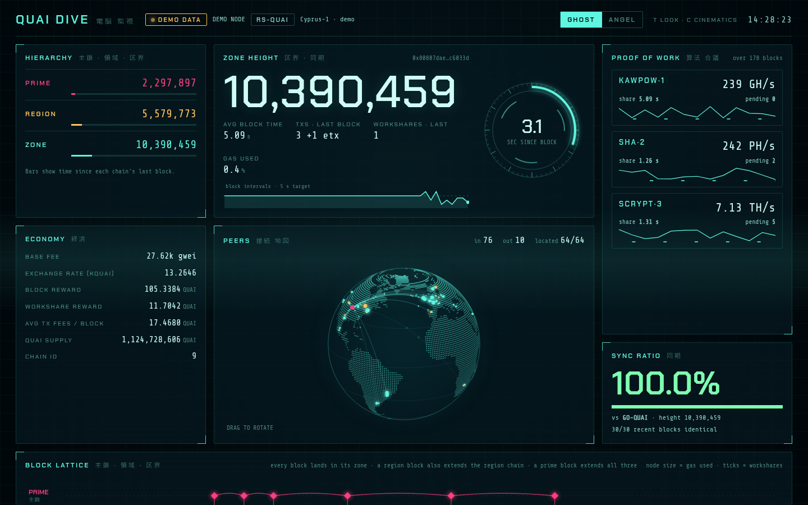
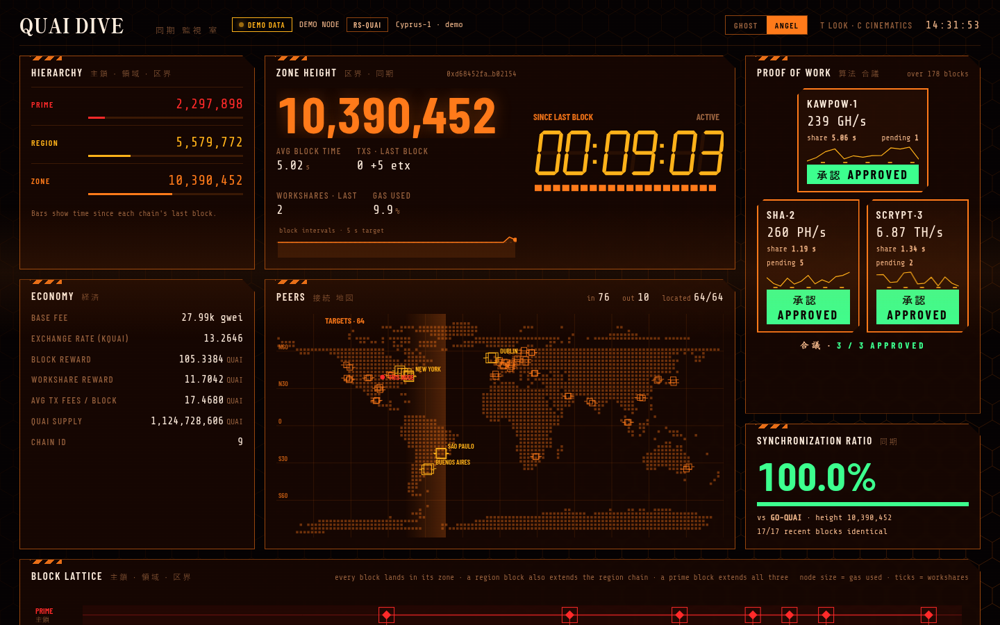
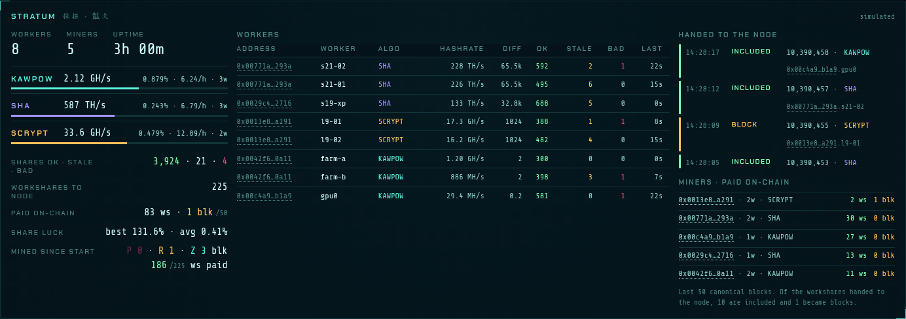
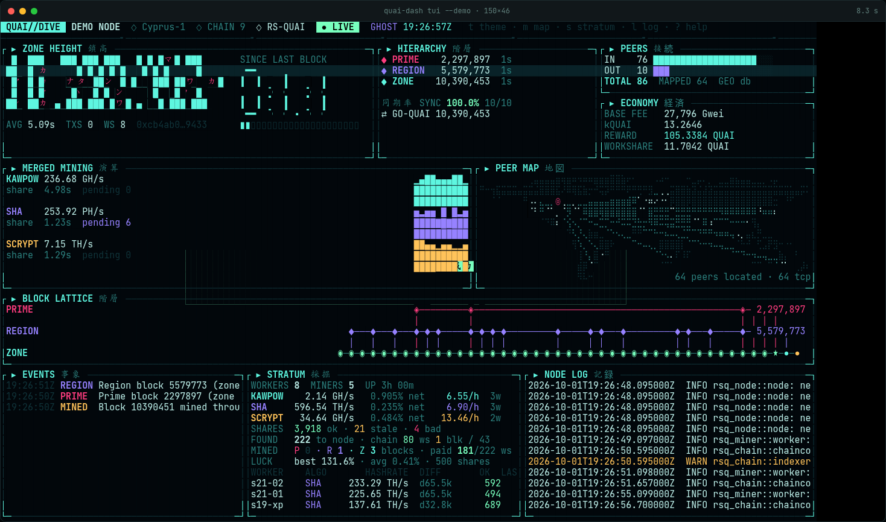
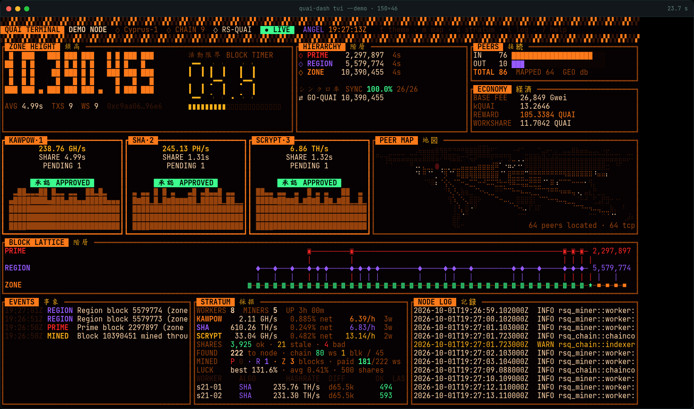

# quai-node-dashboard

[](https://github.com/mpoletiek/quai-node-dashboard/actions/workflows/ci.yml)

`quai-dash`: a live monitor for a Quai node, in the browser or the terminal, with two
looks: **GHOST** (cyan cyberbrain HUD, rotating dot globe) and **ANGEL**
(orange command center: seven-segment block timer, a three-panel vote on
the PoW algorithms, title cards for prime blocks).

It works the same against **rs-quai** and **go-quai**. Everything comes
from what both nodes already offer: their JSON-RPC, their `nodelogs`
directory, the node process's TCP connections (for the peer map) and,
when the node runs a stratum, its stratum API (for the mining view).

## Screenshots

All on demo data (`--demo`): the node, peers and miners are invented.

**Web, GHOST look**



**Web, ANGEL look**



**Web, mining view** (the node's stratum: workers, shares handed to the node, miners paid on chain; addresses link to the block explorer)



**Terminal, GHOST look** (`quai-dash tui`)



**Terminal, ANGEL look** (press `t`)



The terminal shots are frames of `quai-dash record`, played back with
`web/tui.html`.

## Install

Each [release](https://github.com/mpoletiek/quai-node-dashboard/releases)
has static Linux binaries for x86_64 and aarch64 (no dependencies; any
distribution). Each archive holds the binary, the service installer,
`contrib/` and the licenses.

```sh
v=0.1.0 arch=$(uname -m)                   # x86_64 or aarch64
base=https://github.com/mpoletiek/quai-node-dashboard/releases/download/v$v
curl -LO "$base/quai-dash-$v-$arch-linux.tar.gz" -LO "$base/SHA256SUMS"
sha256sum --check --ignore-missing SHA256SUMS
tar xzf "quai-dash-$v-$arch-linux.tar.gz" && cd "quai-dash-$v-$arch-linux"
```

Every archive is also attested as built from this repository by its
release workflow; with the GitHub CLI, `gh attestation verify
quai-dash-$v-$arch-linux.tar.gz --repo mpoletiek/quai-node-dashboard`
checks that.

From source (the toolchain is pinned in `rust-toolchain.toml`; rustup
fetches it): `cargo install --locked --path .` puts `quai-dash` in
`~/.cargo/bin`, or `cargo build --release` leaves it in `target/release/`.

## Quick start

On the node's host, as the node's user:

```sh
quai-dash web                              # then open http://127.0.0.1:8090/
quai-dash tui                              # or the terminal version
quai-dash config                           # what it found, and why
```

(`./quai-dash` from an extracted release archive.) To keep it running,
install it as a [service](#running-as-a-service).

No flags needed: quai-dash finds the node on the zone RPC port, tells
rs-quai from go-quai, follows its logs, maps its peers (placed on the
map with a local GeoIP database, see [Geolocation](#geolocation)) and, if the node runs a
stratum, shows its miners. Everything it detects can be overridden, and
every option can live in a [config file](#configuration).

## What it shows

- Zone height, seconds since the last block, block intervals, and the
  last block's transactions, workshares and gas.
- Prime, region and zone heads. A prime or region block shows up as a
  flash, banner or title card. Press `C` in the browser to turn these off.
- Hashrate, share time and pending workshares for KawPoW, SHA and Scrypt
  (`quai_getMiningInfo`, `quai_getPendingWorkShares`).
- Peers in and out, and a world map of connected peers.
- Base fee, exchange rate, block and workshare rewards, fees and supply.
- A block lattice of the last few minutes: three lanes, prime, region and
  zone. Every block lands in its zone lane; a region block also extends
  the region chain, and a prime block extends all three, joined by
  vertical links. Node size is gas used; ticks are workshares.
- The node's log, colored by level, with a WARN+ filter and pause.
- Events: prime and region blocks, reorgs, stalls, RPC loss and recovery,
  and mismatches against a comparison node.
- With `--compare`, a second node (for example go-quai next to rs-quai)
  is checked block by block. The result is shown as a sync ratio.
- With the node's stratum API, its mining: see [Mining](#mining).

## Mining

The mining view reads the stratum API of the node being watched
(`--node.stratum-api-addr`, port 3336 by default; rs-quai's is a port of
go-quai's, so both work). quai-dash uses the address on the node's
command line, else port 3336 on the RPC host if the node listens there; or set
`--stratum-api URL` (`off` turns it off). The view is the node's: every miner (payout
address) and worker (rig or miner process) connected to its stratum, on
all three algorithms.

- **Overview:** workers connected and the miners behind them; per
  algorithm, this node's hashrate, its share of the network's
  (`quai_getMiningInfo`) and the workshares an hour that share should
  find; shares accepted, stale and rejected; share luck. Then two
  scopes, labeled as such: **since the stratum started**, the shares
  sent to the node and (rs-quai) what the node made of them: blocks by
  tier, workshares it kept and how many of those were paid; and **the
  last N canonical blocks** (shown with the time they span), the
  workshares and blocks paid to this stratum's miners. A workshare paid
  an hour ago counts in the first and not the second.
- **Workers:** a table of every connected worker: address, name,
  algorithm, hashrate, stratum difficulty, shares and the age of its last
  share. The stratum reports a worker's hashrate as a slow average of its
  accepted share difficulty, and its difficulty only after its first share.
- **Handed to the node:** each share that met the workshare target and went
  to the node, settled against the chain: `BLOCK` (it is the canonical
  block at its height), `INCLUDED` (a canonical block carries it as a
  workshare), `PENDING`, or `OLDER` (from before the blocks on screen).
- **Paid in recent blocks:** per miner address, the workshares and
  blocks the last N canonical blocks pay it. The lattice rings those blocks, and
  stars a block found through this node.
- **Events:** each workshare the stratum hands to the node, and each block
  mined through it. A mined block gets its own full-screen moment in both
  looks.

Without a stratum API the panel says how to point at one; if the API stops
answering, the panel says so and the rest of the dashboard carries on.
The API should stay on the node's host (it has no authentication): run
quai-dash there, or tunnel it.

## Detection

Started without flags, quai-dash looks for the node on this host:

1. **The process.** Whoever listens on the zone RPC port (default
   127.0.0.1:9200), found through `/proc/net/tcp` and the processes'
   socket links; failing that, one of your own processes named `rs-quai`
   or `go-quai` (anyone can name a process that). `--node-pid` picks one.
2. **The logs.** Both nodes write `nodelogs/` in their working
   directory, so quai-dash follows `<cwd>/nodelogs` (or
   `<--global.data-dir>/nodelogs`): rs-quai's `global.log`, or
   go-quai's own zone log (`zone-R-Z.log`, from `quai_nodeLocation`).
   Only when quai-dash can read the process, and only a directory and
   file the node's user owns, so a node's command line or a symlink
   can't point it at someone else's files.
3. **The kind** (rs-quai, go-quai or unknown), strongest evidence first:
   - the process name;
   - the log layout and format: go-quai writes per-chain logs
     (`prime.log`, `region-N.log`, `zone-N-M.log`) in logrus format
     (`INFO   [10-01|09:03:52.206] Appended new block   number=…`);
     rs-quai writes `global.log` only, in `tracing` format
     (`2026-10-01T17:23:03.275792Z  INFO rsq_node::node: …`);
   - the stratum API: rs-quai's `/api/pool/stats` has a `mined` tally,
     go-quai's does not;
   - last, a weak hint: go-quai's RPC answers with `Content-Type`,
     rs-quai's with `content-type`. Otherwise the two are RPC-identical.
4. **Endpoints.** Region and prime are the zone host on ports 9002 and
   9001. The stratum API is the node's `--node.stratum-api-addr`, else
   port 3336 if the node itself listens there.

The kind picks the log file and its parser (each line's level is read
from its own field), and shows in the header of both dashboards and on
the startup line:

```text
quai-dash: rs-quai node (process rs-quai (pid 163342)) at http://127.0.0.1:9200
quai-dash: logs /home/node/nodelogs/global.log · stratum http://127.0.0.1:3336 · geo db /usr/share/GeoIP/GeoLite2-City.mmdb
```

Reading another user's process needs that user (or root): quai-dash
then says so, and still shows everything that RPC offers. So does a
remote `--rpc`, where the kind comes from the stratum or header hints,
or stays `unknown`.

## Configuration

Every option is a flag, a `QUAI_DASH_*` environment variable and a key
in a TOML config file. The first that sets an option wins:

**flag > environment > config file > detected > default**

The config file is `--config FILE` (or `QUAI_DASH_CONFIG`), else the
first that exists of `$XDG_CONFIG_HOME/quai-dash/config.toml`,
`~/.config/quai-dash/config.toml` and `/etc/quai-dash/config.toml`.
Unknown keys are errors. [`contrib/config.toml`](contrib/config.toml)
lists every key; for example:

```toml
label = "RS-QUAI SOAK"
logs = "~/node/nodelogs"          # skip detection
compare = "GO-QUAI=http://10.0.0.12:9200"
here = "50.1,8.7"
geoip = "online"
listen = "127.0.0.1:8095"
theme = "angel"
```

`quai-dash config` prints the effective settings and where each came
from (`flag`, `env`, `file`, `detected: …`, `default`), plus the node it
found, the log file and the geolocation source.

| Flag | Environment / file key | Default | |
|---|---|---|---|
| `--rpc URL` | `QUAI_DASH_RPC` / `rpc` | `http://127.0.0.1:9200` | zone JSON-RPC |
| `--region URL`, `--prime URL` | `…_REGION`, `…_PRIME` | zone host, ports 9002 / 9001 | region and prime RPC |
| `--node-kind K` | `…_NODE_KIND` / `node_kind` | `auto` | `auto`, `rs-quai` or `go-quai` |
| `--node-pid PID` | `…_NODE_PID` / `node_pid` | detected | pin the peer map to this process |
| `--logs PATH` | `…_LOGS` / `logs` | detected | a log file or `nodelogs` directory; `off` |
| `--stratum-api URL` | `…_STRATUM_API` / `stratum_api` | detected | the node's stratum API; `off` |
| `--label NAME` | `…_LABEL` / `label` | `QUAI NODE` | name on the dashboard |
| `--explorer URL` | `…_EXPLORER` / `explorer` | `https://explorer.qu.ai` | web: worker and miner addresses link to `URL/address/0x…`; `off` for no links |
| `--compare [LABEL=]URL` | `…_COMPARE` / `compare` | none | a second node's zone RPC to compare blocks with |
| `--geoip MODE` | `…_GEOIP` / `geoip` | `auto` | `auto`, `db`, `online` or `off` ([Geolocation](#geolocation)) |
| `--geoip-db FILE` | `…_GEOIP_DB` / `geoip_db` | detected | MaxMind City database |
| `--geoip-online` | `…_GEOIP_ONLINE` / `geoip_online` | | same as `--geoip online` |
| `--here LAT,LON` | `…_HERE` / `here` | none | this node's position on the map |
| `--stall-secs N` | `…_STALL_SECS` / `stall_secs` | 60 | seconds without a zone block before a stall event |
| `--demo` | `…_DEMO` / `demo` | off | an invented node |
| `--listen ADDR` | `…_LISTEN` / `listen` | `127.0.0.1:8090` | where `web` listens |
| `--theme ghost\|angel` | `…_THEME` / `theme` | `ghost` | `tui`: starting look |
| `--graphics auto\|on\|off` | `…_GRAPHICS` / `graphics` | `auto` | `tui`: pixel peer map (kitty graphics protocol) |
| `--notify` | `…_NOTIFY` / `notify` | off | `tui`: desktop notifications for alerts |

Options go before or after the subcommand (`quai-dash --label X web
--listen …`). Boolean flags take `--flag` or `--flag=false`; in the
environment and the file, `true`/`false`.

The web dashboard listens on 127.0.0.1 unless told otherwise. It has no
authentication: listening on any other address shows the node's logs,
peers and miners to everyone who can reach it, and quai-dash prints a
warning when it does. Prefer an [SSH tunnel](#watching-a-remote-node).

It answers only requests addressed to this machine (an IP address,
`localhost`, or its hostname, bare or `.local`), so a web page you visit
can't read the dashboard by pointing its own domain name at 127.0.0.1.
It holds at most 16 connections, gives each 5 s to send its request,
and answers one request per connection.

## The peer map

Neither node reports peer addresses over RPC. quai-dash finds the process
listening on the zone RPC port and reads that process's established TCP
connections from `/proc`. The same code works for both nodes, with no
changes to the node.

- It needs Linux, and must run on the node's host as the node's user
  (or root).
- It sees TCP peers only; QUIC peers share one UDP socket and can't be
  told apart. So the map usually shows fewer peers than `net_peerCount`.

## Geolocation

By default (`--geoip auto`) peers are placed on the map only from a
local database, and nothing about them leaves the host:

- **Local database**, when found: a MaxMind GeoLite2 or GeoIP2 City
  database (`GeoLite2-City.mmdb`, `GeoIP2-City.mmdb`, or another
  `*City*.mmdb`) in `/usr/share/GeoIP`, `/var/lib/GeoIP`,
  `$XDG_DATA_HOME/GeoIP` or `~/.local/share/GeoIP`, or `--geoip-db FILE`.
  Lookups stay on the host. GeoLite2-City is free from MaxMind with an
  account (Gentoo: `net-misc/geoipupdate`; Debian: `geoipupdate`).
- **Without one, no locations** (the globe shows the peer count as an
  orbit), unless you ask for ip-api.com.
- **`--geoip online`: ip-api.com.** **This sends your peers' IP
  addresses to ip-api.com**, over plain HTTP (its free tier has no
  HTTPS). Lookups run on their own thread, so a slow or unreachable
  ip-api.com never holds up the dashboard; a failed request is retried
  after a minute, then two, up to 30 minutes. quai-dash
  keeps within the free tier: the batch endpoint, at most 100 addresses
  a request and 15 requests a minute, a pause when the service says the
  window is spent (`X-Rl: 0`, or HTTP 429), and every answer cached, so
  an address is asked about once. Private and reserved addresses are
  never sent.
- `--geoip db` uses only the database (an error without one), and
  `--geoip off` turns locations off even with one.

## Running as a service

`scripts/install-service.sh` installs the binary and a service that runs
`quai-dash web` with no flags: detection and the config file supply the
rest.

```sh
cargo build --release                         # from a checkout; a release archive has the binary
scripts/install-service.sh --dry-run          # shows every action, changes nothing
scripts/install-service.sh --run-as node      # install, enable and start as user "node"
scripts/install-service.sh --user             # systemd user unit, no root
scripts/install-service.sh --uninstall
```

| Option | |
|---|---|
| `--init systemd\|openrc` | init system (default: detected from `/run/systemd/system` or `/run/openrc`) |
| `--run-as USER` | user the service runs as (default: whoever runs the installer, never root unless named; `quai-dash` is created if missing) |
| `--user` | a systemd `--user` unit in `~/.config/systemd/user`, binary in `~/.local/bin` (OpenRC: not supported; use the system service with `--run-as` yourself) |
| `--prefix DIR` | binary in `DIR/bin` (default `/usr/local`, `~/.local` with `--user`) |
| `--binary FILE` | binary to install (default: the release archive's, else `target/release/quai-dash`, else the one on PATH) |
| `--uninstall` | stop, disable and remove the service and binary; config and environment files stay |
| `--force` | overwrite an existing config or environment file (never otherwise) |
| `--dry-run` | print every action without doing it |

It prints its plan first and uses sudo only when not already root.

**Run it as the node's user.** Reading the node's logs and its `/proc`
entries (the peer map) needs the node's own user; under the systemd
unit's hardening even root can't read another user's `/proc/<pid>/fd`.
A dedicated `quai-dash` user works, but then shows only what RPC offers.

What gets installed:

| | systemd | OpenRC |
|---|---|---|
| service | `/etc/systemd/system/quai-dash@.service`, enabled as `quai-dash@USER` | `/etc/init.d/quai-dash`, in the `default` runlevel |
| settings | `/etc/default/quai-dash` | `/etc/conf.d/quai-dash` (`QUAI_DASH_USER`) |
| config | `/etc/quai-dash/config.toml` (the user's `~/.config/quai-dash/config.toml` comes first) | same |
| restarts | `Restart=on-failure` | `supervise-daemon` respawn |

Both settings files take `QUAI_DASH_*` variables (exported, for OpenRC)
and `QUAI_DASH_ARGS`, extra arguments for `quai-dash web` (split on
whitespace: values with spaces belong in the config file). The systemd
unit is hardened (`NoNewPrivileges`, `ProtectSystem=strict`,
`ProtectHome=read-only`, `ReadOnlyPaths=/`, `PrivateTmp`, no
capabilities, `@system-service` system calls) and still reads the
node's logs and `/proc` and reaches the network for RPC and
geolocation.

The service's output goes to the journal under systemd
(`journalctl -u quai-dash@USER`), to `/var/log/quai-dash/quai-dash.log`
under OpenRC (`QUAI_DASH_LOG` in `/etc/conf.d/quai-dash` moves it), and,
for the `--user` unit, to `~/.local/state/quai-dash/quai-dash.log`.
Nothing running as root writes inside the run-as user's home.

## Modern terminals

In **kitty**, **Ghostty** and **WezTerm** (detected from `TERM`,
`TERM_PROGRAM`, `KITTY_WINDOW_ID` or `GHOSTTY_RESOURCES_DIR`), the TUI's
peer map is drawn in pixels with the kitty graphics protocol: the GHOST
look gets the rotating dot globe with arcs and travelling packets, ANGEL
gets the reticle map with its sweep. It redraws about four times a
second and steps aside while help, flashes or the boot screen are up.
`--graphics on|off` overrides the detection; elsewhere the map is
braille.

Every terminal gets:
- synchronized output (no tearing in terminals that support it);
- the zone height in the window title;
- with `--notify`, desktop notifications for stalls, reorgs, block
  mismatches and RPC loss (OSC 99 in kitty, OSC 9 elsewhere).

## Watching a remote node

Run quai-dash on the node's host and forward its port:

```sh
ssh -L 8090:127.0.0.1:8090 user@node-host quai-dash web
# then open http://127.0.0.1:8090/
```

Pointing `--rpc` at a remote node works for everything except the peer
map and the logs; the node kind then comes from its stratum API or RPC
header hints, or shows as unknown.

## Keys

- **Web:** `T` switches the look; `C` turns full-screen moments on or
  off. The map can be dragged to rotate. A link ending in `#angel` or
  `#ghost` opens that look.
- **TUI:**
  - `t` switches the look; `m` shows the map full screen; `s` shows the
    stratum (miners, workers, workshares) full screen; `l` shows the log
    full height.
  - `?` opens help; `q` or Esc quits.
  - Below 100×28 the layout keeps only the essentials.

## Demo mode

`quai-dash web --demo` and `quai-dash tui --demo` show an invented node,
for trying the dashboard without one, including a stratum with five
miners and eight workers on all three algorithms.

`quai-dash record --out tour.json` drives the real terminal renderer
through a scripted tour on demo data (both looks, map, stratum, log, help) and
saves the changed cells per frame; `web/tui.html` plays such a file back
in a browser.

`web/index.html` is a self-contained page (its fonts are in
`web/fonts`, next to it; without them it falls back to system fonts). When no quai-dash server
answers (for example, opened on its own), it runs on clearly labeled
demo data, and keeps checking for a server every 10 s. A page that has
shown a live node never switches to demo data: when the server stops
answering it keeps the last real state and says NO SERVER, and when the
state stops moving it says STALE (the TUI does the same).

The world map is Natural Earth 110m land (public domain, via world-atlas
2.0.2), rasterized to a 240×120 bit mask in `assets/land-240x120.bin`.

## Security

Report vulnerabilities privately: see [SECURITY.md](SECURITY.md), which
also says what quai-dash defends against. Changes are in
[CHANGELOG.md](CHANGELOG.md).

## License

MIT (see `LICENSE`). The fonts in `web/fonts` (Barlow Condensed, Chakra
Petch, Share Tech Mono, Shippori Mincho B1, Noto Sans JP, JetBrains
Mono) are Google Fonts' web subsets, unmodified, under the SIL Open Font
License 1.1: see the `OFL-*.txt` files there. The dashboard serves them
itself and loads nothing from other sites.
